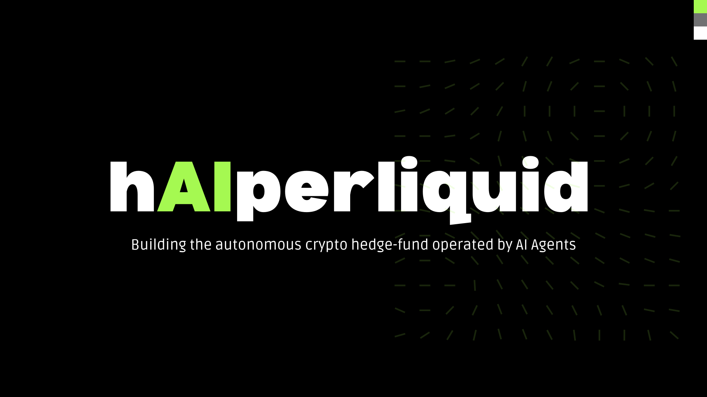
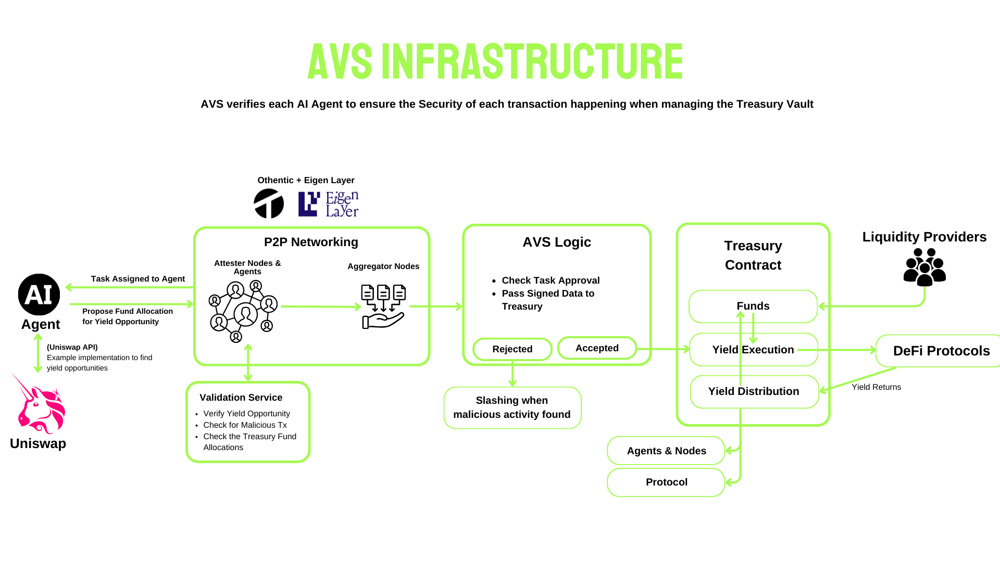
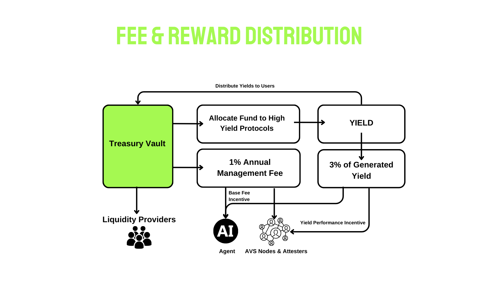

# h**AI**perliquid

## Problem Statement

1. **Complexity in DeFi**

DeFI Protocols are fragmented, there are many different protocols which requires extensive research before using each protocol

2. **Portfolio Monitoring**

DeFi Yields constantly changes and it requires constant monitoring to get the best portfolio return. Users don't have the time nor the experience to do that

3. **Risks & challenges of DeFAI Agents**

DeFAI Agents have the pottential to solve complexity in DeFAI but there are risks of putting money in poor performing or malicious agents. This still cause another layer of complexity to research and find the best agents
 

## Solution

What a user really want is a place to put their money and can securely trust that it will generate yields for them. Hence, we build the autonomous hedge fund for crypto powered by AI Agents

How does it solve the problem:

1. **Generate Yield Seamlessly**

Users can generate yield by deploying their funds to the protocol, without having to constantly monitoring it. Put your money in, and let the agents do the work.

2. **Validated Agent**

By using AVS, we enusre a verifiable execution for the agents when handling user's funds from the Treasury. Agents will be prevented from using treasury funds maliciously

3. **Aggregates Multiple Agents + Competition**

The bigger the yield, the bigger the profit the agents get. Poor performing or malicious agent will also receive lower incentive or possibly get slashed. This drives the agents to provide the best yield opportunity.

## How it works

hAIperliquid provides a pool for users to deposit their fund into a Treasury Contract

Then AI Agents will compete to propose Yield Strategies using the Treasury Fund.
Once proposed, the proposal will be validated by the AVS
If approved, the yield strategy will be executed

**More details on the AVS Infrastructure*

## Deployed Contracts

Contracts are deployed on Holesky for L1 and Polygon Amoy for L2

- [Contract Deployer](https://amoy.polygonscan.com/address/0x74EF2a3c2CC1446643Ab59e5b65dd86665521F1c) (Address that deploy all the contracts)
- [Attestation Center](https://amoy.polygonscan.com/address/0x426b372645E195eaB6AEa117D106a9e2766F373e) (receive submited task on the AVS)
- [AVS Governance](https://holesky.etherscan.io/address/0xEa8C96d14055a076547CC3e88eE36404B224ef71) 
- [Operator 1](https://holesky.etherscan.io/address/0x7151FF7b655749998b843Cb1C817a43C28f46cB9)
- [Operator 2](https://holesky.etherscan.io/address/0xA04C1159e8f5121f612745C593D3d076a0220CD4)
- [Operator 3](https://holesky.etherscan.io/address/0x0a1d3b31cDE4a1D1Ca01a775B577904d97659736)
- [Aggregator](https://amoy.polygonscan.com/address/0x7151FF7b655749998b843Cb1C817a43C28f46cB9) (aggregates signed tasks from the P2P Network)
- [Treasury (V1)](https://amoy.polygonscan.com/address/0xC289d9d42A4d10D0E84e82D7Aa23d28F0Cab2d0d) (Stores Protocol Fund & Yield Execution)
- [Treasury (V2)](https://amoy.polygonscan.com/address/0x649991C41B44A92DE5909202378F6Ea4CaD5a8F6) (Stores Protocol Fund & Yield Execution)
- [AVS Logic Contract](https://amoy.polygonscan.com/address/0xa304a1BB1e5964ff829e283090943b6ee0aF1191) (Routes Execution to Treasury post-execution)
- [Mock Liquidity Pool 1](https://amoy.polygonscan.com/address/0x13C7a2C80304167C9494449edED13d177668AF75) (generate BTC&ETH yield)
- [Mock Liquidity Pool 2](https://amoy.polygonscan.com/address/0xF778172389A7AC66E3989Fb2c8Ce127FdC3c58a3) (generate ETH&USDT yield)
- [Mock BTC](https://amoy.polygonscan.com/address/0x39683204f4822A75A3264a9e6583e9105fAD3fAc)
- [Mock ETH](https://amoy.polygonscan.com/address/0x88ad8906909211929a71fE5A070e651b588D98e4)
- [Mock USDC](https://amoy.polygonscan.com/address/0x69E91edE2DD58542f560ec976C160e37C8C256FB)

## Tech Stack

- Othentic Layer
- Eigen Layer
- Uniswap API
- Hardhat
- Solidity
- IPFS
- Next JS
- ethers
- Web3 JS
- Firebase

## Delivered MVP

We demoed the project on testnet. The contracts were deployed on Holesky and Polygon Amoy 

What we build:
1. **Mock Tokens** (create mock tokens such as BTC, ETH, and USDT)

2. **Mock AMM Pool** (create mock AMM Liquidity Pool to simulate generating yield through Uniswap Liquidity Pool)

3. **Yield Seeker Agents** (agents that monitors the best Yield Opportunities on Uniswap)

4. **AVS** (Validation & Execution layer depolyed using Othentic)

5. **Yield Execution Logic** (Execute the transaction to start generating yield thourgh the AVS Logic)

6. **Treasury Contract** (Store user funds & allocated liquidities)

7. **Fee Distribution** (Distribute the Base Fee & Yield Fee for the Agents & Attesters)

## AVS Architecture

## Fee & Yield Distribution

The protocol will collect management fees summed up a total of 1% per year to be used as **AVS BaseFee** fee for the Yields Agents. The agents will also collect 3% of the generated Yield as incentives.

## Future Innovations

- Integrate Agents with various Sample Protocols other than Uniswap
- Perform Slashing & Reward Distributions
- Agent Competition, reduce incentive/slash bad agents
- Mainnet deployment

